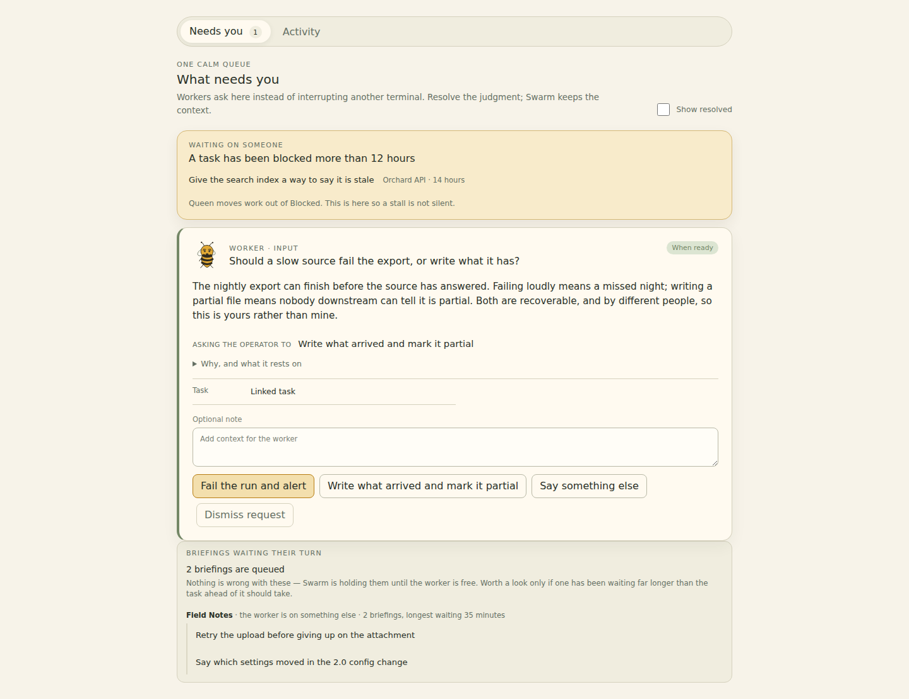

# Swarm

Swarm is a persistent control room for a group of AI coding agents. It runs on
one Linux machine as your own systemd user services, keeps agent sessions alive
across browser reloads and application updates, and gives you a single queue for
the decisions only you can make.

It is a ground-up redesign of the earlier Python Swarm — now called Swarm
Legacy — preserving the outcomes that proved useful while replacing accidental
architecture and implementation-driven behaviour.



Every worker keeps a terminal that survives browser reloads and application
updates, so you can read what one is doing and take the keyboard at any point.


## Start here

| If you want to | Read |
| --- | --- |
| Install it | [docs/install.md](docs/install.md) |
| Use it day to day | [docs/using-swarm.md](docs/using-swarm.md) |
| Understand what changed from Legacy | [docs/moving-from-legacy.md](docs/moving-from-legacy.md) |

The rest of this file is for people working on Swarm itself.

## Intended product qualities

- Agent sessions outlive browsers, UI components, and application updates.
- Switching terminals feels like switching editor tabs: immediate and stable.
- Reload, sleep, reconnect, and update are routine recovery paths.
- Every queue, buffer, and retained history has an explicit bound.
- Core state transitions are typed, transactional, observable, and testable.
- Integrations extend the product through declared application interfaces.
- Operators install, run, update, and diagnose one application.

## Implementation direction

- Rust modular monolith for the application and terminal/session backend.
- A TypeScript browser adapter, currently rendered with React.
- SQLite as the embedded source of truth, owned by one persistence boundary.
- Versioned HTTP, event, and terminal synchronization contracts.

React does not own terminal or worker lifetime and remains replaceable behind
the browser adapter boundary. See [docs/README.md](docs/README.md) for the
accepted decisions and continuing review sequence.

## Relationship to legacy Swarm

The legacy `miopea/swarm` repository remains the stable daily driver and an
executable source of product evidence. Swarm does not port a module merely
because it exists. Each capability is classified as keep, redesign, merge, or
remove before implementation.

## Current milestone

**M2: Daily-driver dogfood and integration foundation**

The M1 runtime invariants are now implemented and remain continuous regression
gates: bounded terminal history, immutable worker/session identity, stable
browser attachment, API/browser restart survival, and persisted task-to-worker
delivery. The multi-day resource soak continues; later features do not waive
that evidence.

M2 moves ordinary work into Swarm: durable worker/task ergonomics, Jira
work intake and reconciliation, closed-loop Outlook issue intake, first-class
desktop/Android operation, and the authenticated Jira-backed Apiary foundation.
Dogfood evidence determines the order within M2; legacy remains the independent
fallback until these journeys carry normal work reliably.

## Development

```sh
cargo test --workspace
pnpm install --frozen-lockfile
pnpm check
pnpm test
pnpm build
```

Run the terminal host and API in separate shells with a shared socket path. The
host and API are separate process owners shipped as one application:

```sh
export SWARM_TERMINAL_SOCKET="$HOME/.local/state/swarm/run/terminal.sock"
export SWARM_TERMINAL_HISTORY_DIR="$HOME/.local/state/swarm/terminal-history"
export SWARM_WORKSPACE_ROOTS="/absolute/path/to/workspaces"
cargo run -p swarm-terminal-host

# In the API shell, set the same socket and a development-only secret.
export SWARM_OPERATOR_TOKEN="replace-with-a-long-random-development-token"
cargo run -p swarm-api
```

Run the browser client with `pnpm --dir web dev` on the fixed development URL
`http://127.0.0.1:8766`. It proxies `/health` and
HTTP/WebSocket `/api` traffic to `127.0.0.1:8765`. Unlock the development UI
with the same operator token configured for the API. A successful unlock creates
a 30-day, same-origin, HttpOnly browser session so refreshes and PWA restarts
stay unlocked. The raw operator token is never saved in Web Storage. Use Lock to
revoke the trusted-browser session; rotating `SWARM_OPERATOR_TOKEN` also
invalidates it. Do not commit or log operator tokens.

Inspect or drive the terminal-host update drain through the typed lifecycle
client. It never kills workers or deletes sockets:

```sh
cargo run -p swarm-cli --bin swarmctl -- status
cargo run -p swarm-cli --bin swarmctl -- drain
cargo run -p swarm-cli --bin swarmctl -- wait-ready 300
cargo run -p swarm-cli --bin swarmctl -- cancel-drain
```

## Ubuntu/Debian dogfood package

Install and first-run instructions live in [docs/install.md](docs/install.md).
The short version, working from a clone:

```sh
./packaging/linux/build-development-release.sh /tmp/swarm-build
sh /tmp/swarm-build/swarm-*/swarm-package install /tmp/swarm-build/swarm-*
```

To produce a distributable tarball instead, tag the commit first — a release
version comes from a tag so that two releases can be compared, and
`build-release.sh` refuses an untagged commit by design:

```sh
git tag -a v0.1.0 -m "Swarm 0.1.0"
./packaging/linux/build-release.sh                     # writes dist/swarm-0.1.0-linux-x86_64.tar.gz
tar -xzf dist/swarm-0.1.0-linux-x86_64.tar.gz
./swarm-0.1.0-linux-x86_64/swarm-package install ./swarm-0.1.0-linux-x86_64
```

The packaged UI listens on `http://127.0.0.1:8766`. Releases are staged under
`~/.local/lib/swarm`, configuration is written once under
`~/.config/swarm`, and durable terminal history remains under
`~/.local/state/swarm`. Content-hashed browser assets are retained under
`~/.local/lib/swarm/assets` so a tab opened before an update can still load
a deferred terminal module afterward. The writable workspace defaults to
`~/swarm-workspaces`; set `SWARM_WORKSPACE_ROOT` during the first install to
choose a different absolute path. Use `update RELEASE_DIR`, `rollback`, or
`uninstall`. Uninstall preserves configuration and state.
Compatible updates switch the API and browser release, then restart only
`swarm-api.service`; the independently versioned terminal-host process and
its worker PTYs stay alive. Run `swarm-package reconcile-host` when workers
are idle to move the sidecar to the current release.
When a release changes the terminal protocol, stop all Swarm workers and
run `swarm-package migrate-protocol RELEASE_DIR`. The migration drains the
old host, refuses active sessions, switches the API and sidecar together, and
restores both previous pointers if health verification fails.

Claude runs with the operator's ordinary `~/.claude` profile. Workers therefore
inherit the same credentials, custom slash commands, skills, hooks, plugins, and
conversation history the operator already uses at the terminal, and any shared
configuration installer that writes to the documented default location applies
to Swarm workers without extra steps. Swarm additionally points every Claude
worker at `~/.claude/settings.json` explicitly, so permissions and auto-mode
policy stay consistent even when a worker is started by the service rather than
a login shell.

No separate profile authentication step is required: if `claude` works in the
operator's terminal, it works for a worker.

The user service runs while the user manager is active. A remote host that must
keep running after logout may require an administrator to enable user lingering;
the installer does not elevate privileges or change that host policy.

Each immutable release ID includes its Git commit. The builder refuses a dirty
worktree so an installed artifact always maps back to one reviewable source
state and can coexist with later `0.1.0` dogfood builds.
